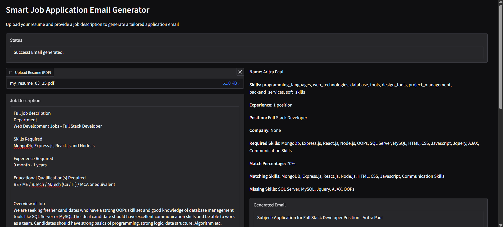
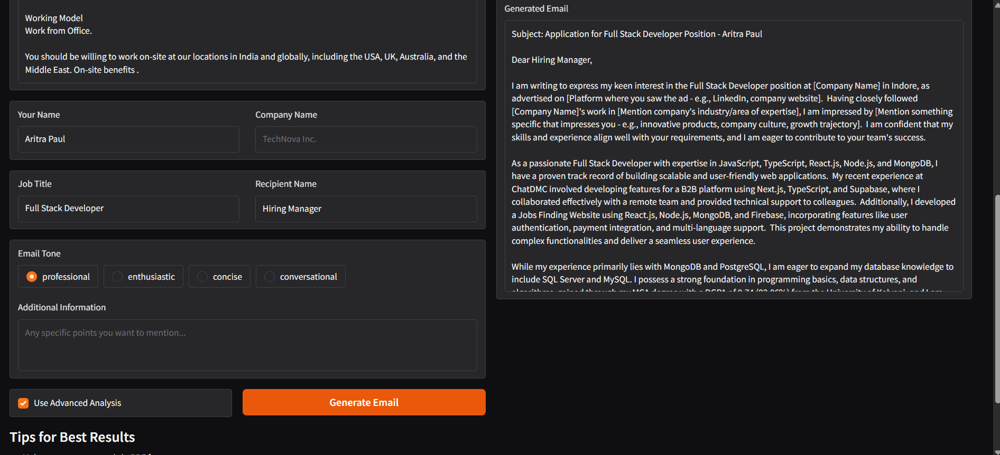

# Mail Assistant Project

## Table of Contents
- [Overview](#overview)
- [Features](#features)
- [Installation](#installation)
- [Usage](#usage)
- [Requirements](#requirements)
- [Usage Options](#usage-options)
- [Capstone Project Information](#capstone-project-information)
- [Contributing](#contributing)
- [License](#license)
- [Acknowledgments](#acknowledgments)

## Overview
This project is a Smart Job Application Email Generator that utilizes the Gemini API to analyze resumes and job descriptions, generating tailored application emails. The application features a user-friendly Gradio interface for easy interaction.

## Features
- Upload PDF resumes and job descriptions.
- Generate personalized application emails based on resume and job analysis.
- Advanced analysis mode for detailed skill matching and email generation.
- User-friendly interface with clear instructions and error handling.

## UI
- Screenshot (1)
 
- Screenshot (2)
 

## Installation
1. Clone this repository:
   ```
   git clone https://github.com/yourusername/mail-assistant-gen-ai.git
   cd mail-assistant-gen-ai
 
2. To run this project, you need to install the required dependencies. You can do this by running:

   ```bash
   pip install -r requirements.txt
   ```
3. Get a Google Gemini API key from [Google AI Studio](https://aistudio.google.com/app/apikey)

## Usage
1. Ensure you have a valid Google API key for the Gemini API. Set your API key in the `gradio_interface.py` file or as an environment variable:
   ```python
   GOOGLE_API_KEY = "your-api-key-here"  # Replace with your API key
   ```
2. Run the Gradio interface:
   ```bash
   python gradio_interface.py
   ```
3. Open the provided URL in your web browser.
4. Upload your resume and paste the job description to generate a tailored email.

## Requirements
The following packages are required for this project:
- `google-generativeai>=0.8.0`
- `PyMuPDF>=1.22.0`
- `gradio>=4.0.0`
- `pandas>=2.0.0`
- `ipython>=8.0.0`
- `notebook>=7.0.0`

## Usage Options

### Basic Mode

If you choose the basic mode (uncheck "Use Advanced Analysis"), the application will:
- Take your resume and job description
- Generate an email directly without detailed analysis
- Provide a faster result with less detailed matching

### Advanced Mode

In advanced mode (default), the application will:
- Analyze your resume to extract key information
- Analyze the job description to identify requirements
- Match your skills against job requirements
- Generate a highly tailored email based on the analysis
- Provide summary information about the match

## Capstone Project Information

This project was developed as a capstone for the Google GenAI 2025 course. It demonstrates the application of generative AI to solve real-world problems in job search and application processes.

## Contributing
Feel free to fork the repository and submit pull requests for any improvements or bug fixes.

## License
This project is licensed under the MIT License.

## Acknowledgments

- Google Gemini API for providing the AI capabilities
- PyMuPDF for PDF text extraction
- Gradio for the web interface 
